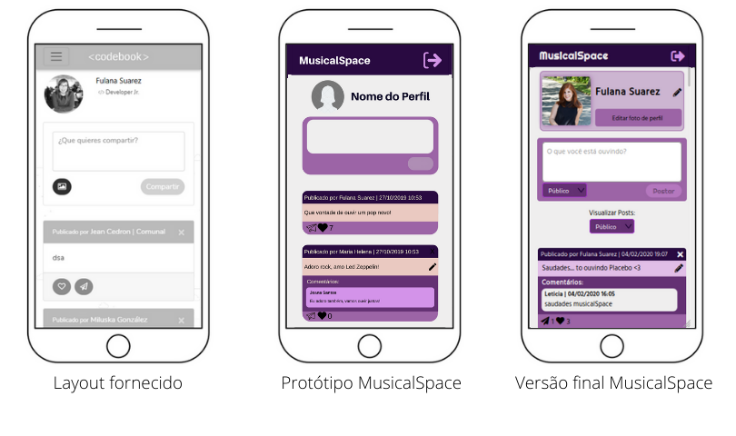

# MusicalSpace

> O desafio deste projeto foi a construção de uma Single-Page Application (SPA) responsiva na 
qual poderíamos escrever, ler, atualizar e deletar dados.

***

## Índice

* [1. MusicalSpace](#1-musicalspace)
* [2. Histórias de usuário](#2-histórias-de-usuário)
* [3. Protótipos e versão final](#3-protótipos-e-versão-final)
* [4. Tecnologias utilizadas](#4-tecnologias-utilizadas)

*** 

## 1. MusicalSpace

O MusicalSpace é uma rede social que foi desenvolvida pensando na necessidade do nosso usuário de compartilhar
seus gostos musicais, eventos, playlists e tudo relacionado ao mundo da música, além de interagir
com outros usuários e descobrir novidades.

Nossa rede social é destinada a todos os tipos de público, de todas as idades, que gostem de música
e queiram interagir com outros usários.

O projeto segue o conceito de Mobile First, e nos preocupamos em desenvolver uma interface acessível e intuitiva para o usuário.

MusicalSpace foi desenvolvido com *HTML5*, *CSS3*, *JavaScript(ES6+)* e *Firebase*.

***

## 2. Histórias de usuário

**Para este projeto recebemos histórias de usuário pré-definidas:**

* Como usuário novo, devo poder criar uma conta com email e senha válidos para poder iniciar uma sessão e ingressar na Rede Social.

* Como usuário novo, devo poder ter a opção de iniciar sessão com minha conta do Google para ingressar na Rede Social sem necessidade de criar uma conta de email válido.

* Como usuário logado devo poder criar, guardar, modificar no mesmo lugar (in place) e deletar publicações (post) privadas ou públicas.

* Como usuário logado devo poder ver todos os posts públicos e privados que criei até o momento, do mais recente para o mais antigo, assim como a opção de trocar a configuração de privacidade dos meus posts.

* Eu como usuário logado, posso dar like e ver a contagem de likes em minhas publicações

* Eu como usuário logado, posso escrever e deletar um comentário nas publicações.

* Ao final devo poder ingressar na Rede Social e poder visualizar os dados de meu perfil criado e editá-los.

Ordenamos o desenvolvimento do projeto pensando em quais seriam as prioridades do usuário dentro de uma rede
social, tendo isso em mente implementamos as histórias nessa ordem:

1. Criar uma nova conta com email e senha.
2. Fazer login na rede social.
3. Postar uma publicação.
4. Editar e deletar uma publicação.
5. Dar like em publicações.
6. Editar nome e foto de perfil.
7. Comentar e deletar comentários.
8. Fazer posts públicos ou privados e selecionar qual destes tipos visualizar.

***

## 3. Protótipos e versão final

Recebemos dois layouts para seguir como protótipos de baixa fidelidade e, a partir destes, desenvolvemos os relativos ao nosso porjeto.

### Layouts de login

### Layouts do Feed

## 4. Tecnologias utilizadas

* HTML5
* CSS3
* JavaScript(ES6)
* [Babel](https://babeljs.io/)
* [ESLint](https://www.npmjs.com/package/eslint-config-airbnb)
* [Toastify.js](https://www.npmjs.com/package/toastify-js)
* [Serve](https://www.npmjs.com/package/serve)
* [Firebase](https://firebase.google.com/)

***

